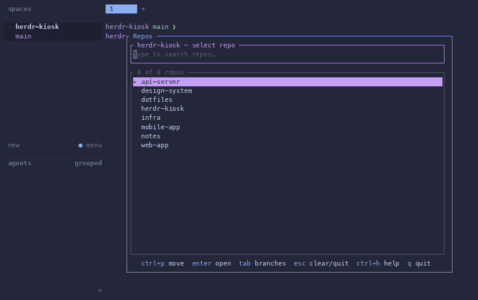

# herdr-kiosk

Fuzzy-find Git repositories and branches, then open them as Herdr workspaces and
worktrees.



## Install

Install from the public GitHub repository:

```sh
herdr plugin install thomasschafer/herdr-kiosk
```

On Linux and macOS, installation downloads the version-matched release binary,
verifies its SHA-256 checksum, and falls back to `cargo build --release` if the
download cannot be used. Windows builds from source with Cargo for now.

Herdr 0.7.4 does not render plugin actions in its menus. Keybindings are the only
way to surface the picker, so add this once to your Herdr config:

```toml
[[keys.command]]
key = "prefix+f"
type = "plugin_action"
command = "thomasschafer.herdr-kiosk.open-picker"
description = "open repo picker"
```

Then reload the configuration:

```sh
herdr server reload-config
```

The first time the picker opens, a setup wizard asks for the directories to scan
and the scan depth. It writes the plugin's `config.toml`; find its directory at any
time with:

```sh
herdr plugin config-dir thomasschafer.herdr-kiosk
```

Herdr v1 has no `plugin update` command. To refresh the plugin, reinstall it from
GitHub.

## Usage

The repository view fuzzy-filters discovered repositories. Press `enter` to open
the selected repository's main checkout, or `tab` to switch to its branch view.
The branch view combines local branches, remote-only branches, and existing
worktrees; `enter` focuses an existing checkout or asks Herdr to create and focus a
new worktree.

Default bindings:

| Key | Where | Action |
| --- | --- | --- |
| `ctrl+c` | Anywhere | Quit the picker |
| `ctrl+h` | Anywhere | Show active bindings |
| `ctrl+x` | Notification | Dismiss the notification |
| `↑` / `ctrl+p` | Lists | Move up |
| `↓` / `ctrl+n` | Lists | Move down |
| `esc` | Search | Clear the query |
| `backspace` | Search | Delete the previous character |
| `alt+backspace` / `ctrl+w` | Search | Delete the previous word |
| `←` / `→` | Search | Move the cursor |
| `enter` | Repository view | Open the main checkout |
| `tab` | Repository view | Show branches |
| `q` | Repository view | Quit |
| `enter` | Branch view | Open or create the selected checkout |
| `esc` | Branch view | Return to repositories |
| `ctrl+o` | Branch view | Create a new branch |
| `ctrl+x` | Branch view | Delete the selected checkout |
| `enter` / `esc` | Dialogs | Confirm / cancel |

The `ctrl+h` overlay shows the active bindings for the current view, including
configuration overrides. Type there to fuzzy-filter by key, command, or description;
`esc` closes help without changing the picker query underneath.

To create a branch, type its new name in the branch view and press `ctrl+o`, then
choose the base branch. Deletion removes a Herdr-created linked worktree but keeps
the Git branch. The main checkout and remote-only branches cannot be deleted. An
open checkout closes its Herdr workspace first, and a dirty checkout requires a
second confirmation.

## Configuration

`search_dirs` accepts simple paths, paths with a per-directory depth, or both.
Simple paths use depth `1`; `~` and `~/...` are expanded from your home directory.

```toml
search_dirs = [
  "~/Code",
  { path = "~/Work", depth = 3 },
  "/opt/company/repos",
]
```

Optional `on_open` panes are created in order after any workspace is opened or
created. Each pane runs its command from the checkout directory without taking
focus from the primary pane. `direction` accepts `left`, `right`, `up`, or `down`;
`ratio` is optional and must be greater than `0` and less than `1`.

```toml
[on_open]
panes = [
  { command = "hx", direction = "right" },
  { command = "cargo test", direction = "down", ratio = 0.35 },
]
```

Keybindings are layered. Add entries under any of `[keys.general]`,
`[keys.text_edit]`, `[keys.list_navigation]`, `[keys.modal]`,
`[keys.repo_select]`, or `[keys.branch_select]`. A mode-specific binding wins over
a shared binding. Chords use `C-`/`Ctrl-`, `A-`/`Alt-`/`M-`, and `S-`/`Shift-`
modifiers with a character or one of `enter`, `esc`, `tab`, `backspace`, `delete`,
`up`, `down`, `left`, `right`, `home`, `end`, `pageup`, `pagedown`, and `space`.

```toml
[keys.repo_select]
"C-j" = "open"

[keys.branch_select]
"C-b" = "new_branch"
"C-o" = "noop"
```

Available action names are `noop`, `quit`, `help`, `dismiss_toast`, `move_up`,
`move_down`, `open`, `branches_view`, `back`, `new_branch`, `delete`, `clear`,
`backspace`, `delete_word`, `cursor_left`, and `cursor_right`. The aliases `none`,
`unbound`, `show_help`, `enter_repo`, `go_back`, `delete_worktree`, and
`clear_query` are also accepted.

The theme uses terminal palette colors rather than RGB values. Every field is
optional; these are the defaults:

```toml
[theme]
accent = "magenta"
secondary = "cyan"
tertiary = "green"
error = "red"
warning = "yellow"
muted = "dark_gray"
border = "dark_gray"
hint = "blue"
highlight_fg = "black"
open = "green"
```

`accent` identifies the repository picker, `secondary` identifies branch and
new-branch flows, and `tertiary` identifies help.

Accepted colors are `black`, `red`, `green`, `yellow`, `blue`, `magenta`, `cyan`,
`white`, `gray`, `dark_gray`, and `reset`. On a detected light terminal background,
the untouched `muted` and `border` defaults are adjusted from `dark_gray` to `gray`.

## Windows support

Windows is supported and uses PowerShell launch shims plus a native
`x86_64-pc-windows-msvc` binary. Installation currently needs Rust and Cargo because
the PowerShell fetch path is not implemented yet.

Automated Windows CI covers formatting, compilation, clippy, tests, and PowerShell
syntax. Before relying on it in a critical workflow, hand-test popup opening and
install/link paths, drive-letter and UNC search paths, Git-for-Windows error text,
remote authentication with prompts disabled, and linked worktree creation/deletion.
Herdr's verbatim `\\?\` and `\\?\UNC\` plugin paths are normalized by the launchers,
but those paths remain part of the manual release check.

## Trust and security

Herdr does not sandbox or review plugins: their build and runtime commands run as
your user with your environment and full Herdr CLI access. During installation,
this plugin downloads and verifies a release binary or runs Cargo. At runtime it
executes `git` to inspect repositories and branches and the `herdr` CLI to open,
focus, create, and remove Herdr worktrees and workspaces. Review the manifest,
scripts, and source before installing if that access is not acceptable.

## Development

Build the release binary before linking the working tree. `herdr plugin link` does
not run `[[build]]` commands.

```sh
cargo build --release
herdr plugin link /path/to/herdr-kiosk
```

`just link` combines those steps. Run the full popup integration suite with
`just e2e`; it needs a built Herdr checkout next to this repository unless `HERDR`
points elsewhere. The harness design and manual-driving details are in
[`docs/VERIFYING.md`](docs/VERIFYING.md).
